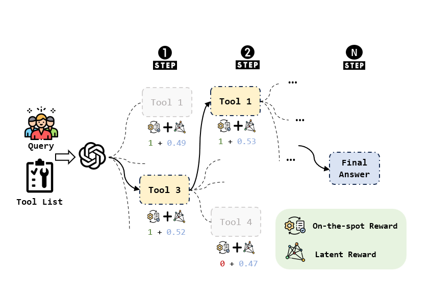

# CodeTool: Enhancing Programmatic Tool Invocation of LLMs via Process Supervision

# Overview

In this paper, we introduce **CodeTool**, a stepwise code generation framework based on process supervision. By leveraging code as a naturally verifiable format, we obtain an **On-the-spot Reward** to reflect step correctness and train a PRM on fully automated process data to assign a **Latent Reward**, which measures the potential of each step toward overall task completion. At each inference step, LLMs follow the reasoning path **with maximal cumulative reward of On-the-spot Reward and Latent Reward.**



# Installation

## Environment Setup

```txt
# Create conda environment
conda create -n codetool python=3.9
conda activate codetool

# Install requirements
pip install -r requirements.txt
```

# Adaptations to StableToolBench

## 1、Build the API server

To set up the API server, follow the [StableToolBench](https://github.com/THUNLP-MT/StableToolBench) instructions.

First, download the tool cache from [HuggingFace](https://huggingface.co/datasets/stabletoolbench/Cache/tree/main).

After downloading, unzip the folder into the `StableToolBench/server` folder and ensure the `server` folder contains `tool_response_cache` folder and `tools` folder. The resulting folder of `server` looks like:

```txt
├── /server/
│  ├── /tools/
│  │  └── ...
│  ├── /tool_response_cache/
│  │  └── ...
│  ├── config.yml
│  ├── codetool_main.py
│  ├── utils.py
```

------

Next, specify your configurations in `StableToolBench/server/config.yml`

```yaml
api_key: # your api_key
api_base: # your api_base
model: # model_name
temperature: 0
toolbench_url: http://8.130.32.149:8080/rapidapi
rapidapi_key: # your toolbench_key
tools_folder: "./tools"
cache_folder: "./tool_response_cache"
is_save: true
port: 8082
```

------

For StableToolBench, we have made some adaptations to ensure that the API responses can be parsed by the code (for details, please refer to the paper). Therefore, please run the modified codetool_mian.py

```shell
cd StableToolBench/server
python codetool_main.py
```

The server will be run at `http://localhost:{port}/virtual`. To use the server, you will further need a toolbench key. You can apply one from this [form](https://forms.gle/oCHHc8DQzhGfiT9r6).

## 2、Test Set Filtering

In our experiments, we find that even when the model provides the same API and request parameters as those used in the StableToolBench experiments, some requests fail due to the absence of cache hits.  To ensure a fair comparison of experimental results, we filter out entries from the StableToolBench test set that are non-reproducible. The specific criteria for exclusion are detailed in Appendix. 

The new test set is under `StableToolBench/solvable_queries/filter_test_instruction`.

# Process Data & Rewards Setting

For the training of the process Latent Reward model, we select tools and APIs that are still accessible from the ToolBench training set and automatically construct intermediate process data for tool invocation. 

First, specify your configurations in `src/config.yaml`.

```yaml
api_key: # your api_key
api_base: # your api_base
model: # model_name
temperature: 0.9
top_p: 0.95
n: 2
toolbench_key: # your toolbench_key
stabletoolbench_server: http://0.0.0.0:8082/virtual
MAX_DEPTH: 5
```

To get the process data and rewards, please run the code:

```shell
cd CodeTool
export PYTHONPATH=./
python src/run_rapid.py
```

- The process data will be saved at `data/process_data/{test_set}/dfs_data/{query_id}_path.json`.
- All the rewards(On-the-spot Reward and Latent Reward) for the process data will be saved at `data/process_data/{test_set}/path_scored/{query_id}_scored.json`.
- The data pairs at the same hierarchical level with different potential values will be saved at `data/process_data/{test_set}/pair_path/{query_id}_pair.json`.

# Generative PRM Training

Following previous work, to avoid disrupting the native structure of the LLM, we adopt a generative PRM training method. Specifically, we designate two special tokens to represent the `more potential` and `less potential` labels based on Latent Reward values, and then fully reuse the training method of SFT. 

**Get the Train Data of Generative PRM**

```shell
python src/rm_generative_data.py
```

If you have already obtained data pairs with different potential values, you can simply use the [LLaMA_Factory](https://github.com/hiyouga/LLaMA-Factory) framework for SFT training.

**Example Command for LLaMA-Factory STF Training.**

```bash
cd LLaMA-Factory

# Qwen
MODEL_NAME_OR_PATH="Qwen2.5-7B-Instruct"
OUTPUT_DIR="..."
TEMPLATE="qwen"

# LLaMA
# MODEL_NAME_OR_PATH="Meta-Llama-3-8B-Instruct"
# OUTPUT_DIR="..."
# TEMPLATE="llama3"

DATASET="..."
LEARNING_RATE=1.0e-6
DEEPSPEED_CONFIG="ds_z3_offload_config.json"

torchrun --nproc_per_node=8 src/train.py \
  --model_name_or_path ${MODEL_NAME_OR_PATH} \
  --deepspeed examples/deepspeed/${DEEPSPEED_CONFIG} \
  --stage sft \
  --do_train true \
  --finetuning_type full \
  --dataset ${DATASET} \
  --template ${TEMPLATE} \
  --cutoff_len 8192 \
  --max_samples 10000 \
  --overwrite_cache true \
  --preprocessing_num_workers 16 \
  --output_dir ${OUTPUT_DIR} \
  --logging_steps 2 \
  --save_steps 100 \
  --plot_loss true \
  --overwrite_output_dir true \
  --per_device_train_batch_size 1 \
  --gradient_accumulation_steps 2 \
  --learning_rate ${LEARNING_RATE} \
  --num_train_epochs 2.0 \
  --lr_scheduler_type cosine \
  --warmup_ratio 0.1 \
  --ddp_timeout 180000000 \
  --val_size 0.1 \
  --per_device_eval_batch_size 1 \
  --eval_strategy steps \
  --eval_steps 25
```

# Inference

## 1. Run the base model using vLLM

If you don't want to incur additional API costs, you can use open-source models loaded locally for code generation. 

For the code generation of open-source LLMs, we recommend setting up a new Conda environment for vLLM by following the [installation guide](https://docs.vllm.ai/en/latest/getting_started/installation.html).

To build a vLLM server for the `Qwen2.5-7B-Coder-Instruct` model, you can use the following command:

```shell
export CUDA_VISIBLE_DEVICES=0,1,2,3
python -m vllm.entrypoints.openai.api_server --host *** \
    --port 8080 \
    --tensor-parallel-size 4 \
    --gpu-memory-utilization 0.9 \
    --model llm_weights/Qwen2.5-Coder-7B-Instruct \
    --served-model-name Qwen2.5-Coder-7B-Instruct \
    --api-key *** \
    --dtype auto
```

In this way, you can accelerate the inference of the LLMs and use the same code as when requesting the OpenAI service to obtain the response.

## 2. Run the Process Reward Model

To run the PRM, first configure `server/rm_server.sh`

```shell
MODEL_PATH=""
HOST=""
PORT=8081

python server/qwen_rm_server.py \
    --model_path "$MODEL_PATH" \
    --host "$HOST" \
    --port "$PORT"
```

------

Then, run the scripts:

```shell
bash server/rm_server.sh
```

The PRM will run at `http://{host}:{port}/generate `(rm_url)

## 3. Specify your configurations

Specify your configurations in `infer/config.yaml`.

```shell
rm_url:
api_key:
api_base:
model:
temperature: 0.9
top_p: 0.95
n: 2
tmdb_headers: {"Authorization": "Bearer ...}"}
```

Register a TMDB API key from the [TMDB Developer Center](https://developer.themoviedb.org/docs/getting-started) and copy the api key to `tmdb_headers` in the `config.yaml` file.

------

## 4.  Inference on StableToolBench

To run the **CodeTool** framework on StableToolBench:

```shell
export PYTHONPATH=./
python infer/step_infer.py
```

The infer result will be saved at `data/stepwise_infer_result/{model_type}/{test_set}/{qid}.json`.

------

If you haven't trained the PRM, you can simply run `step_infer_wo_latent.py`, which generates next step towards the correct code execution. If there are multiple directions for correct execution at the current step, one of them will be randomly selected. 

```shell
export PYTHONPATH=./
python infer/step_infer_wo_latent.py
```

The infer result without `Latent Reward` will be saved at `data/stepwise_infer_result/{model_type}_wo_latent/{test_set}/{qid}.json`.

## 5. Inference on RestBench-TMDB

To run the **CodeTool** framework on RestBench-TMDB:

```shell
export PYTHONPATH=./
python infer/tmdb/tmdb_infer.py
```

The infer result will be saved at `data/stepwise_infer_result/tmdb/{qid}.json`.

------

If you haven't trained the PRM, you can simply run `tmdb_infer_wo_latent`, which generates next step towards the correct code execution. If there are multiple directions for correct execution at the current step, one of them will be randomly selected. 

```shell
export PYTHONPATH=./
python infer/tmdb/tmdb_infer_wo_latent.py
```

The infer result will be saved at `data/stepwise_infer_result/tmdb_wo_latent/{qid}.json`.

# Run the Evaluation Scripts

For the evaluation on SoPR, please run the below `run_pass_rate` scripts:

```shell
export test_set=G1_Instruction # G1_Instruction, G1_Category, G1_Tool, G2_Category, G2_Instruction, G3_Instruction
MODEL_NAME=qwen25_coder_7b

python eval_pass_rate.py \
    --data_path_prefix /data/test_set_infer_result/${MODEL_NAME} \
    --save_path_prefix /data/eval_result/${MODEL_NAME} \
    --inst_version v2 \
    --test_set ${test_set} \
```

```
bash eval/run_pass_rate.sh
```

# Citation

If you find this work helpful, please cite our paper:

```shell
@article{lu2025codetool,
  title={CodeTool: Enhancing Programmatic Tool Invocation of LLMs via Process Supervision},
  author={Lu, Yifei and Ye, Fanghua and Li, Jian and Gao, Qiang and Liu, Cheng and Luo, Haibo and Du, Nan and Li, Xiaolong and Ren, Feiliang},
  journal={arXiv preprint arXiv:2503.20840},
  year={2025}
}
```

# License

This project is released under the [MIT License](https://github.com/LimOkii/CodeTool/main/LICENSE).

